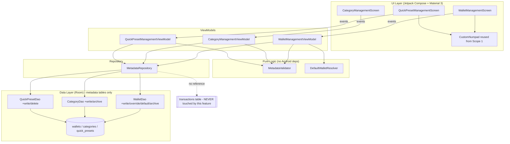
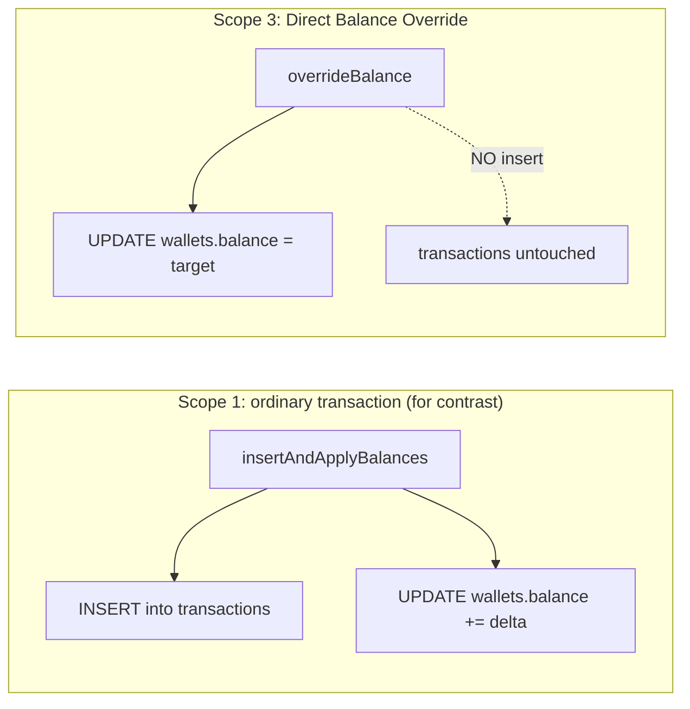

# Design Document: Customization & Metadata

## Overview

The Customization & Metadata feature implements **Scope 3** of the PRD: management of the metadata entities that the Transaction Input Engine (Scope 1) and the Transaction History & Audit feature (Scope 2) consume — **Wallets** ("kantong"), **Categories**, and **Quick Presets**. It provides create / read / update / archive for Wallets and Categories, create / read / update / delete for Quick Presets, single **Default Wallet** assignment, and a **Direct Balance Override** that manually sets a Wallet balance.

The defining constraint of this feature is drawn straight from `AGENTS.md` **Data Rule 3**: a **Direct Balance Override modifies only the `wallets` row and never records a `Transaction`**. This is what distinguishes an override from an ordinary transaction — an ordinary transaction (Scope 1) changes a wallet balance *by way of* a persisted log entry inside an atomic insert-log + update-balance write, whereas an override changes the balance *without* any log entry at all. This feature therefore **never writes to, and never mutates, the `transactions` table** under any operation (Requirement 15).

Removal of Wallets and Categories is by **archiving (soft delete, `is_archived = 1`)** rather than hard delete, so that historical `Transaction` records that reference them stay valid and consistent with the "non-archived" selection wording used by Scope 1 and Scope 2. Quick Presets, which are never referenced by a persisted `Transaction` (Scope 1 copies the preset *value* into the running amount, not a foreign key), are hard-deleted.

This design **reuses Scope 1 & 2's domain model and data layer** rather than redefining them. It consumes the existing `TransactionType` enum, the existing `Wallet` / `Category` / `QuickPreset` domain models (balances and amounts as non-negative `Long` values in the smallest currency unit), the existing Room entities (`WalletEntity`, `CategoryEntity`, `QuickPresetEntity`), and the existing mapper functions (`toDomain()`). It **adds only management capability**: new DAO write/observe methods on the three metadata tables, new repository surfaces, new ViewModels, and new Compose management screens. The Scope 1 transactions write path (`TransactionDao.insertAndApplyBalances`) is left completely untouched.

The design follows MVVM as mandated by `ARCHITECTURE.md`:

- **UI layer** — Jetpack Compose + Material 3. Three management surfaces (`WalletManagementScreen`, `CategoryManagementScreen`, `QuickPresetManagementScreen`), each stateless: render `StateFlow` UI state and dispatch events.
- **ViewModel** — one ViewModel per surface, each owning an immutable UI state exposed via `StateFlow`, observing metadata `Flow`s, running pure validation, and orchestrating persistence.
- **Repository** — a `MetadataRepository` exposing observable `Flow`s plus suspend write/archive/override/default-assignment operations that return `Result`.
- **Data layer** — new read-only observers and write/atomic methods on the existing `wallets` / `categories` / `quick_presets` DAOs; no schema changes (the `is_archived` flags already exist on the entities from Scope 1).

### Requirements Traceability Summary

| Area | Requirements |
| --- | --- |
| Create a Wallet (name/balance validation, default-when-first) | 1 |
| Read Wallets (Observable_Stream of Active_Wallet) | 2 |
| Update a Wallet name (other fields unchanged) | 3 |
| Direct Balance Override (only balance, no transaction, atomic) | 4 |
| Archive a Wallet (soft delete, default reassignment, tx untouched) | 5 |
| Assign the Default Wallet (exactly-one-default atomic invariant) | 6 |
| Create a Category (name/type validation, TRANSFER rejected, optional icon) | 7 |
| Read Categories (Observable_Stream of Active_Category) | 8 |
| Update a Category (partial update, TRANSFER rejected, tx untouched) | 9 |
| Archive a Category (soft delete, tx untouched) | 10 |
| Create a Quick Preset (amount/label validation) | 11 |
| Read Quick Presets (Observable_Stream) | 12 |
| Update a Quick Preset (partial update, validation) | 13 |
| Delete a Quick Preset (hard delete, others + tx untouched) | 14 |
| Transaction integrity under all metadata changes (cross-cutting) | 15 |

### Design Directives Honored (AGENTS.md)

- **Data Rule 3 (override must not create a transaction entry) — the central invariant.** `Direct_Balance_Override` is implemented as a single `UPDATE wallets SET balance = :value WHERE id = :id`. It never calls a `transactions` insert. This is explicitly contrasted with Scope 1's `insertAndApplyBalances` (which pairs an insert with a balance delta). Enforced structurally: the `MetadataRepository` and metadata DAOs have **no reference to `TransactionDao` and no access to the `transactions` table** (Requirements 4.3, 4.4, 15.1, 15.2).
- **Data Rule 1 (`@Transaction` for atomic multi-row writes).** Default-wallet assignment must set one `is_default = 1` and clear all others as an all-or-nothing operation; it is a single `@Transaction`-annotated DAO method. Archive-with-default-reassignment likewise runs inside one `@Transaction` so the exactly-one-default invariant never has an observable gap (Requirements 6.1, 6.2, 6.5, 5.5).
- **Data Rule 2 (Flow/StateFlow real-time observation).** All three collections are exposed as Room `Flow`s. Because Room re-emits on any table change, a create / update / archive / delete / override propagates automatically and live into Scope 1 (input wallet/category selectors, preset chips) and Scope 2 (wallet/category filter chips) with no manual refresh (Requirements 2.4, 8.4, 12.4).
- **UI Rule 1 (custom numpad, no OS keyboard for numbers).** The numeric inputs in this feature — a Wallet's initial balance, a `Direct_Balance_Override` target value, and a `Quick_Preset` amount — reuse Scope 1's `CustomNumpad` composable pattern with a non-focusable amount display, so the OS keyboard never appears for numeric entry. Text fields (wallet/category/preset names and labels) use the OS keyboard normally, as they are not numeric.
- **UI Rule 2 (one-handed ergonomics).** Primary actions (create/save buttons, the numpad for balance/amount entry) sit in the lower region of each management screen, consistent with Scope 1's layout and aesthetic.

## Architecture

### Layered View



The dashed, crossed edge is a design assertion: the `MetadataRepository` has no dependency path to the `transactions` table. Data Rule 3 and Requirement 15 hold **by construction**, not merely by discipline.

### Direct Balance Override vs. Scope 1's Transactional Write



Both change a wallet balance, but only the Scope 1 path writes a `transactions` row. The override path is a single-row `UPDATE` with **no** insert — the concrete realization of Data Rule 3 (Requirements 4.1, 4.3, 4.4).

### Default-Wallet Assignment (atomic, exactly-one invariant)

```mermaid
sequenceDiagram
    participant VM as WalletManagementViewModel
    participant R as MetadataRepository
    participant D as WalletDao (@Transaction)
    VM->>R: setDefaultWallet(targetId)
    R->>R: guard: target exists & not archived (Req 6.4)
    R->>D: @Transaction { clearAllDefaults(); setDefault(targetId) }
    alt commit succeeds
        D-->>R: Unit
        R-->>VM: Result.success
        Note over D: wallets Flow re-emits; exactly one is_default = 1
    else commit fails
        D-->>R: throws
        R-->>VM: Result.failure (prior default retained, Req 6.5)
    end
```

`clearAllDefaults()` then `setDefault(targetId)` run inside a single `@Transaction`, so no intermediate state with zero or two defaults is ever observable (Requirement 6.2).

### Threading

- UI events mutate only in-memory `StateFlow` values on the main thread (fast, synchronous).
- All Room `Flow` collection and every suspend write/override/archive/default operation run in `viewModelScope` on `Dispatchers.IO`, so persistence never blocks the main thread (consistent with the Sync/Network directive of keeping the main thread free, applied here to metadata I/O).

## Components and Interfaces

### UI Layer (Jetpack Compose + Material 3)

Three stateless screens, each `Screen(state, onEvent)`, styled to match Scope 1's modern "Gemini" aesthetic (airy spacing, rounded surfaces, pill chips, selective accent on primary buttons):

**`WalletManagementScreen`**
- A `LazyColumn` of wallets showing name, balance (integer smallest-unit), and a default marker (Requirements 2.1, 2.3).
- Create / edit flow: a text field for the name and, for the initial balance and for the override, a non-focusable amount display driven by the reused `CustomNumpad` (UI Rule 1).
- Per-row actions: **Set default**, **Archive**, **Edit name**, **Override balance**. The override input opens a numpad sheet whose Save button lives in the lower region (UI Rule 2).
- Validation errors surface inline next to the offending field, sourced from `state.error`.

**`CategoryManagementScreen`**
- Two grouped sections, **INCOME** and **EXPENSE** (Requirement 8 grouping); `TRANSFER` is never offered as a selectable type (Requirements 7.3, 9.3).
- Create / edit flow: name text field, an INCOME/EXPENSE single-choice control, and an optional icon picker (Requirements 7.1, 7.4, 9.1).
- Per-row actions: **Edit**, **Archive**.

**`QuickPresetManagementScreen`**
- A `LazyColumn` of presets showing amount and label (Requirements 12.1, 12.3).
- Create / edit flow: numpad-driven amount (UI Rule 1) + label text field.
- Per-row actions: **Edit**, **Delete** (hard delete, Requirement 14).

All three screens hold no business logic beyond formatting and event dispatch. Validation results, list contents, and error indications arrive precomputed in state.

### Events

```kotlin
sealed interface WalletManagementEvent {
    data class CreateWallet(val name: String, val initialBalance: Long?) : WalletManagementEvent // null balance -> 0 (Req 1.4)
    data class RenameWallet(val walletId: Long, val name: String) : WalletManagementEvent
    data class OverrideBalance(val walletId: Long, val targetBalance: Long) : WalletManagementEvent
    data class ArchiveWallet(val walletId: Long) : WalletManagementEvent
    data class SetDefaultWallet(val walletId: Long) : WalletManagementEvent
    data object ErrorConsumed : WalletManagementEvent
}

sealed interface CategoryManagementEvent {
    data class CreateCategory(val name: String, val type: TransactionType, val icon: String?) : CategoryManagementEvent
    data class UpdateCategory(val categoryId: Long, val name: String?, val type: TransactionType?, val icon: String?) : CategoryManagementEvent
    data class ArchiveCategory(val categoryId: Long) : CategoryManagementEvent
    data object ErrorConsumed : CategoryManagementEvent
}

sealed interface QuickPresetManagementEvent {
    data class CreatePreset(val amount: Long, val label: String) : QuickPresetManagementEvent
    data class UpdatePreset(val presetId: Long, val amount: Long?, val label: String?) : QuickPresetManagementEvent
    data class DeletePreset(val presetId: Long) : QuickPresetManagementEvent
    data object ErrorConsumed : QuickPresetManagementEvent
}
```

### ViewModels

Each ViewModel observes the relevant metadata `Flow`, exposes a `StateFlow`, validates via `MetadataValidator` before persisting, and maps repository `Result` outcomes into either a state refresh or an `error` field. Example (Wallet):

```kotlin
class WalletManagementViewModel(
    private val repository: MetadataRepository
) : ViewModel() {

    val uiState: StateFlow<WalletManagementUiState> =
        repository.observeWallets()
            .map { WalletManagementUiState(wallets = it) }
            .flowOn(Dispatchers.IO)
            .stateIn(viewModelScope, SharingStarted.WhileSubscribed(5_000), WalletManagementUiState.Initial)

    fun onEvent(event: WalletManagementEvent) {
        when (event) {
            is WalletManagementEvent.CreateWallet -> viewModelScope.launch {
                when (val v = MetadataValidator.validateWalletCreate(event.name, event.initialBalance ?: 0L)) {
                    is ValidationResult.Invalid -> setError(v.reason)     // Req 1.2, 1.3
                    is ValidationResult.Valid   -> repository.createWallet(v.value).handle()
                }
            }
            is WalletManagementEvent.OverrideBalance -> viewModelScope.launch {
                when (val v = MetadataValidator.validateBalance(event.targetBalance)) {
                    is ValidationResult.Invalid -> setError(v.reason)     // Req 4.2
                    is ValidationResult.Valid   -> repository.overrideBalance(event.walletId, v.value).handle()
                }
            }
            /* Rename, Archive, SetDefault, ErrorConsumed ... */
        }
    }
}
```

The ViewModels never touch `transactions`; the only persistence they can reach is the metadata write surface of `MetadataRepository`.

### Pure Logic (extracted, no Android dependency)

These objects hold the input-varying logic and are the primary property-test targets.

```kotlin
/** Result of validating a metadata submission. Carries the sanitized value on success. */
sealed interface ValidationResult<out T> {
    data class Valid<T>(val value: T) : ValidationResult<T>
    data class Invalid(val reason: ValidationError) : ValidationResult<Nothing>
}

enum class ValidationError {
    NAME_EMPTY, NAME_TOO_LONG, BALANCE_OUT_OF_RANGE, AMOUNT_OUT_OF_RANGE,
    LABEL_EMPTY, LABEL_TOO_LONG, TYPE_NOT_PERMITTED
}

object MetadataValidator {
    const val MAX_MONEY: Long = 999_999_999_999L
    const val WALLET_NAME_MAX = 100
    const val CATEGORY_NAME_MAX = 50
    const val PRESET_LABEL_MAX = 50

    /** Trims name; valid when 1..100 chars and balance in 0..MAX_MONEY (Req 1.1, 1.2, 1.3, 1.4). */
    fun validateWalletCreate(rawName: String, balance: Long): ValidationResult<NewWallet>

    /** Trims name; valid when 1..100 chars (Req 3.1, 3.2). */
    fun validateWalletName(rawName: String): ValidationResult<String>

    /** Valid when balance in 0..MAX_MONEY (Req 4.1, 4.2). */
    fun validateBalance(balance: Long): ValidationResult<Long>

    /** Trims name; valid when 1..50 chars AND type != TRANSFER (Req 7.1, 7.2, 7.3, 9.2, 9.3). */
    fun validateCategory(rawName: String, type: TransactionType): ValidationResult<CategoryFields>

    /** Valid when amount in 1..MAX_MONEY AND trimmed label in 1..50 chars (Req 11.1, 11.2, 11.3). */
    fun validatePreset(amount: Long, rawLabel: String): ValidationResult<PresetFields>
}

object DefaultWalletResolver {
    /**
     * Given the active wallets that remain after archiving the current default, returns the id of
     * the wallet that should become the new default: the one whose name sorts first
     * case-insensitively, ties broken by lowest id; or null when none remain (Req 5.5, 5.6).
     */
    fun pickReplacementDefault(remainingActive: List<Wallet>): Long?
}
```

Validation trims leading/trailing whitespace before length checks (Requirements 1.1, 3.1, 7.1, 11.1); range checks use inclusive bounds `0..MAX_MONEY` for balances and `1..MAX_MONEY` for preset amounts.

### Repository

```kotlin
interface MetadataRepository {
    // Observation (Data Rule 2)
    fun observeWallets(): Flow<List<Wallet>>            // Active_Wallet only (Req 2.1, 2.2)
    fun observeCategories(): Flow<List<Category>>        // Active_Category only (Req 8.1, 8.2)
    fun observeQuickPresets(): Flow<List<QuickPreset>>   // all presets (Req 12.1, 12.2)

    // Wallet writes
    suspend fun createWallet(wallet: NewWallet): Result<Unit>              // Req 1
    suspend fun renameWallet(walletId: Long, name: String): Result<Unit>  // Req 3
    suspend fun overrideBalance(walletId: Long, target: Long): Result<Unit> // Req 4 — NO transaction
    suspend fun archiveWallet(walletId: Long): Result<Unit>               // Req 5
    suspend fun setDefaultWallet(walletId: Long): Result<Unit>            // Req 6

    // Category writes
    suspend fun createCategory(fields: CategoryFields): Result<Unit>      // Req 7
    suspend fun updateCategory(categoryId: Long, patch: CategoryPatch): Result<Unit> // Req 9
    suspend fun archiveCategory(categoryId: Long): Result<Unit>          // Req 10

    // Quick Preset writes
    suspend fun createPreset(fields: PresetFields): Result<Unit>          // Req 11
    suspend fun updatePreset(presetId: Long, patch: PresetPatch): Result<Unit> // Req 13
    suspend fun deletePreset(presetId: Long): Result<Unit>               // Req 14
}
```

There is deliberately **no** transaction-write method and **no** `TransactionDao` dependency on this interface — the type itself keeps this feature out of the `transactions` table (Requirement 15). Each write catches thrown exceptions into `Result.failure` so the ViewModel never sees raw exceptions and the affected store is left in its prior state on failure (Requirements 4.7, 6.5, 15.4). `archiveWallet` and `setDefaultWallet` delegate to atomic DAO methods; `overrideBalance` delegates to a single-row balance update.

### Data Layer (Room DAOs)

This feature adds methods to the existing metadata DAOs; it reuses Scope 1's entities and introduces **no schema change** (the `is_archived` columns already exist).

```kotlin
// Added to the existing WalletDao (alongside Scope 1's observeActiveWallets / observeDefaultWallet)
@Insert suspend fun insert(wallet: WalletEntity): Long
@Query("UPDATE wallets SET name = :name WHERE id = :id") suspend fun updateName(id: Long, name: String)

/** Direct Balance Override: a single balance UPDATE. NO transactions insert (Data Rule 3, Req 4). */
@Query("UPDATE wallets SET balance = :balance WHERE id = :id")
suspend fun overrideBalance(id: Long, balance: Long)

@Query("UPDATE wallets SET is_archived = 1 WHERE id = :id") suspend fun markArchived(id: Long)
@Query("SELECT COUNT(*) FROM wallets WHERE is_archived = 0") suspend fun activeCount(): Int
@Query("SELECT * FROM wallets WHERE id = :id") suspend fun findById(id: Long): WalletEntity?

@Query("UPDATE wallets SET is_default = 0") suspend fun clearAllDefaults()
@Query("UPDATE wallets SET is_default = 1 WHERE id = :id") suspend fun setDefault(id: Long)

/** Atomic exactly-one-default assignment (Data Rule 1, Req 6.1, 6.2). */
@Transaction
suspend fun assignDefault(id: Long) { clearAllDefaults(); setDefault(id) }

/** Atomic archive + deterministic default reassignment (Req 5.1, 5.5, 5.6). */
@Transaction
suspend fun archiveAndReassignDefault(id: Long, replacementId: Long?) {
    markArchived(id)
    if (replacementId != null) { clearAllDefaults(); setDefault(replacementId) }
}
```

```kotlin
// Added to the existing CategoryDao
@Insert suspend fun insert(category: CategoryEntity): Long
@Update suspend fun update(category: CategoryEntity)
@Query("SELECT * FROM categories WHERE id = :id") suspend fun findById(id: Long): CategoryEntity?
@Query("UPDATE categories SET is_archived = 1 WHERE id = :id") suspend fun markArchived(id: Long)
```

```kotlin
// Added to the existing QuickPresetDao (alongside Scope 1's observeAll)
@Insert suspend fun insert(preset: QuickPresetEntity): Long
@Update suspend fun update(preset: QuickPresetEntity)
@Query("DELETE FROM quick_presets WHERE id = :id") suspend fun deleteById(id: Long)   // hard delete (Req 14)
@Query("SELECT * FROM quick_presets WHERE id = :id") suspend fun findById(id: Long): QuickPresetEntity?
```

None of these methods reference the `transactions` table. The override is a single-row `UPDATE` with no accompanying insert — the mechanical realization of Data Rule 3.

## Data Models

### Reused Domain Models (from Scope 1 & 2 — unchanged)

`TransactionType { EXPENSE, INCOME, TRANSFER }`, and the `Wallet`, `Category`, and `QuickPreset` domain models as already defined in `com.alx.moneytracker.domain`. Balances and amounts remain non-negative `Long` values in the smallest currency unit. The existing `WalletEntity`, `CategoryEntity`, `QuickPresetEntity`, and the `toDomain()` mappers in `data.local.Mappers` are reused as-is; **no field, entity, or migration is added.**

### New Write-Side Value Types

```kotlin
/** A validated new wallet ready to persist (is_default resolved by the repository per Req 1.5). */
data class NewWallet(val name: String, val balance: Long)

/** Validated category fields for creation (type is guaranteed INCOME or EXPENSE). */
data class CategoryFields(val name: String, val type: TransactionType, val icon: String?)

/** Partial category update; a null field means "leave unchanged" (Req 9.1). */
data class CategoryPatch(val name: String? = null, val type: TransactionType? = null, val icon: String? = null)

/** Validated preset fields for creation. */
data class PresetFields(val amount: Long, val label: String)

/** Partial preset update; a null field means "leave unchanged" (Req 13.1). */
data class PresetPatch(val amount: Long? = null, val label: String? = null)
```

### UI State

```kotlin
data class WalletManagementUiState(
    val wallets: List<Wallet> = emptyList(),   // Active_Wallet, from observeWallets()
    val error: ValidationError? = null,        // set on rejected create/update/override
    val operationFailed: Boolean = false        // set when a persistence Result is failure (Req 4.7, 6.5, 15.4)
) { companion object { val Initial = WalletManagementUiState() } }

data class CategoryManagementUiState(
    val income: List<Category> = emptyList(),  // Active_Category, type == INCOME
    val expense: List<Category> = emptyList(), // Active_Category, type == EXPENSE
    val error: ValidationError? = null,
    val operationFailed: Boolean = false
) { companion object { val Initial = CategoryManagementUiState() } }

data class QuickPresetManagementUiState(
    val presets: List<QuickPreset> = emptyList(),
    val error: ValidationError? = null,
    val operationFailed: Boolean = false
) { companion object { val Initial = QuickPresetManagementUiState() } }
```

The category screen derives its two groups by partitioning `observeCategories()` on `type` (Requirement 8 grouping). Room entities are reused from Scope 1; no new entity or migration is introduced.

## Correctness Properties

*A property is a characteristic or behavior that should hold true across all valid executions of a system — essentially, a formal statement about what the system should do. Properties serve as the bridge between human-readable specifications and machine-verifiable correctness guarantees.*

The input-varying logic of this feature — validation, the exactly-one-default invariant, deterministic default reassignment, override overwrite semantics, partial-update merging, soft-delete preservation, and the transaction-integrity invariant — either is pure or holds as an invariant over an arbitrary metadata store. Its behavior varies meaningfully across a large input space (arbitrary names with surrounding whitespace, balances and amounts across and beyond the valid range, transaction types, multi-wallet stores, and operation sequences), which makes it well suited to property-based testing. Reactive exposure and re-emission (the Room `Flow` contract), induced-failure rollback paths, and a couple of null-mapping specifics do not vary meaningfully with input and are covered by integration and example tests instead (see Testing Strategy).

The prework analysis consolidated the many per-entity acceptance criteria into a minimal, non-redundant set. The transaction-integrity criteria across every operation (4.3, 4.4, 5.4, 9.5, 10.4, 14.2, 15.1–15.3) collapse into one central invariant; the many validation-rejection criteria (including the two TRANSFER-rejection criteria) collapse into one validation-correctness property; and the several default-wallet criteria collapse into one exactly-one-default invariant plus one deterministic-selection property.

### Property 1: No metadata operation ever mutates the transactions store

*For any* contents of the `Transactions_Store` and *any* metadata operation (create / rename / update / override / archive / delete / set-default on any Wallet, Category, or Quick_Preset), after the operation the `Transactions_Store` contains exactly the same number of `Transaction` records as before and every field value of every existing `Transaction` record is identical to its value before the operation. In particular, a `Direct_Balance_Override` adds no `Transaction` record.

**Validates: Requirements 4.3, 4.4, 5.4, 9.5, 10.4, 14.2, 15.1, 15.2, 15.3**

### Property 2: Archiving is a soft delete that preserves the record

*For any* Wallet or Category whose `is_archived` value is false, archiving it sets that record's `is_archived` value to true while retaining the record in its store (the store's record count is unchanged and the record remains retrievable by its identifier), and thereafter the record is excluded from the collection of active records exposed through the `Observable_Stream`.

**Validates: Requirements 5.1, 5.2, 10.1, 10.2**

### Property 3: Archiving an already-archived record is a no-op

*For any* Wallet or Category whose `is_archived` value is already true, archiving it again leaves the `Wallets_Store`/`Categories_Store`, the `Default_Wallet` designation, and the `Transactions_Store` unchanged.

**Validates: Requirements 5.7, 10.5**

### Property 4: Exactly one active wallet is the default whenever an active wallet exists

*For any* sequence of wallet operations (create, set-default, archive), after each operation the `Wallets_Store` has exactly one `Active_Wallet` with `is_default` equal to true when at least one `Active_Wallet` exists, and none when no `Active_Wallet` exists; no intermediate state with zero or two-or-more active defaults is ever observable. Consequently, creating a wallet into a store with no `Active_Wallet` makes it the default and creating into a non-empty store does not; designating an `Active_Wallet` sets exactly that wallet's `is_default` to true and clears all others; designating the current default is a no-op; and designating an archived wallet is rejected with the prior default retained.

**Validates: Requirements 1.5, 6.1, 6.2, 6.3, 6.4**

### Property 5: Default reassignment on archive selects deterministically

*For any* set of `Active_Wallet` records remaining after the current `Default_Wallet` is archived, the wallet chosen as the new `Default_Wallet` is the one whose name sorts first in case-insensitive ascending order, with ties broken by the lowest wallet identifier; when no `Active_Wallet` remains, no wallet is designated as the `Default_Wallet`.

**Validates: Requirements 5.5, 5.6**

### Property 6: Direct Balance Override overwrites only the target balance

*For any* `Wallets_Store` and *any* target balance in `0..999999999999`, applying a `Direct_Balance_Override` to a wallet sets that wallet's `Balance` exactly to the target value (an overwrite, not a delta), leaves that wallet's name, `is_default`, and `is_archived` values unchanged, and leaves the `Balance` of every other wallet unchanged.

**Validates: Requirements 4.1, 4.5, 4.6**

### Property 7: Renaming a wallet changes only its name

*For any* existing Wallet and *any* valid new name, renaming persists the trimmed name on that wallet and leaves its `Balance`, `is_default`, and `is_archived` values unchanged.

**Validates: Requirements 3.1, 3.3**

### Property 8: Validation accepts valid input and rejects invalid input without mutating any store

*For any* submitted metadata fields, validation succeeds if and only if all of the following hold for the entity kind: a Wallet or Category or Preset name/label, after trimming leading and trailing whitespace, has length within its bound (1..100 for a Wallet name, 1..50 for a Category name and a Preset label); a Wallet balance is within `0..999999999999` and a Preset amount is within `1..999999999999`; and a Category `Transaction_Type` is INCOME or EXPENSE (never TRANSFER). When validation fails, the operation returns an indication identifying the specific invalid field and leaves the target store unchanged (no record created, updated, or removed).

**Validates: Requirements 1.1, 1.2, 1.3, 3.1, 3.2, 4.1, 4.2, 7.1, 7.2, 7.3, 9.2, 9.3, 11.1, 11.2, 11.3, 13.2, 13.3**

### Property 9: A partial update changes only the submitted fields

*For any* existing Category or Quick_Preset and *any* valid partial update in which some fields are omitted (null), applying the update persists exactly the submitted (validated, trimmed) fields and leaves every omitted field — including a Category's `is_archived` value — equal to its prior value.

**Validates: Requirements 9.1, 9.4, 13.1**

### Property 10: A valid creation persists exactly the submitted fields

*For any* valid Wallet, Category, or Quick_Preset submission, the persisted record carries the trimmed name/label, the submitted balance/amount, the submitted `Transaction_Type` and icon (for a Category), and `is_archived` equal to false (for a Wallet or Category).

**Validates: Requirements 1.1, 7.1, 11.1**

### Property 11: Deleting a preset removes only that preset

*For any* `Presets_Store` and *any* Quick_Preset in it, deleting that preset removes exactly that record (it is no longer retrievable and the record count decreases by one) and leaves every other Quick_Preset record unchanged.

**Validates: Requirements 14.1, 14.3**

### Property 12: Entity-to-domain mapping is faithful

*For any* `WalletEntity`, `CategoryEntity`, or `QuickPresetEntity`, mapping it to its domain model preserves every field: a Wallet carries name, balance, `is_default`, and `is_archived`; a Category carries name, `Transaction_Type`, icon, and `is_archived`; a Quick_Preset carries amount and label.

**Validates: Requirements 2.3, 8.3, 12.3**

## Error Handling

| Scenario | Handling | Requirement |
| --- | --- | --- |
| Invalid Wallet/Category/Preset name or label (empty after trim, or over the length bound) | `MetadataValidator` returns `ValidationResult.Invalid` with a `NAME_*` / `LABEL_*` reason; the ViewModel sets `state.error` and does not call the repository, so the store is unchanged. | 1.2, 3.2, 7.2, 9.2, 11.3, 13.3 |
| Balance out of range (`< 0` or `> MAX_MONEY`) on create or override | `MetadataValidator.validateBalance` returns `Invalid(BALANCE_OUT_OF_RANGE)`; no persistence occurs; store unchanged. | 1.3, 4.2 |
| Preset amount out of range (`< 1` or `> MAX_MONEY`) | `MetadataValidator` returns `Invalid(AMOUNT_OUT_OF_RANGE)`; store unchanged. | 11.2, 13.2 |
| Category type is TRANSFER on create or update | `MetadataValidator.validateCategory` returns `Invalid(TYPE_NOT_PERMITTED)`; store unchanged; existing type retained on update. | 7.3, 9.3 |
| Direct Balance Override atomic write fails | The single-row `UPDATE` is caught into `Result.failure`; the wallet balance is retained at its prior value (no partial write on a single statement); ViewModel sets `operationFailed`. No `transactions` write is attempted. | 4.7 |
| Default-wallet designation transaction fails | The `@Transaction` (`clearAllDefaults` + `setDefault`) rolls back as a unit, so the prior default is retained; repository returns `Result.failure`. | 6.5 |
| Archive targets a non-existent wallet | Repository looks up the wallet, finds none, returns `Result.failure` (not-found) without mutating the store. | 5.8 |
| Designate an archived wallet as default | Repository guard checks `is_archived`; rejects with `Result.failure`, prior default retained. | 6.4 |
| Any metadata persistence operation throws | The repository catches the exception into `Result.failure`; the affected store is left in its prior state (single-statement writes are atomic; multi-row writes use `@Transaction`); the `transactions` table is never involved. | 4.7, 6.5, 15.4 |
| Valid wallet created with no initial balance specified | ViewModel maps a null balance to `0L` before validation. | 1.4 |
| Valid category created with no icon | Persisted with a null icon. | 7.4 |

No mutation path to the `transactions` table exists anywhere in this feature; the `MetadataRepository` and metadata DAOs have no `TransactionDao` dependency, so no failure mode can create, remove, or alter a `Transaction` (Requirement 15).

## Testing Strategy

The feature is tested with a **dual approach**: property-based tests for the pure and invariant logic (validation, default invariant, replacement selection, override/rename/patch/create/delete semantics, soft-delete, mapper faithfulness, and the transaction-integrity invariant) and example / integration tests for reactive `Flow` behavior, induced-failure rollback, and the null-mapping specifics.

### Property-Based Tests

- **Library:** [kotest-property](https://kotest.io/docs/proptest/property-based-testing.html) (Kotlin's established property-testing library), consistent with Scope 1 and Scope 2. Property testing is **not** implemented from scratch.
- **Iterations:** each property test runs a minimum of **100 iterations** (`PropTestConfig(iterations = 100)` or higher).
- **Tagging:** each property test carries a comment in the format
  `// Feature: customization-metadata, Property {number}: {property_text}`.
- **Single test per property:** each of Properties 1–12 is implemented by exactly one property-based test.
- **Generators:**
  - Name/label generators producing valid strings (1..bound, including surrounding whitespace to exercise trimming) and invalid strings (empty, all-whitespace, and over-bound).
  - Balance/amount generators spanning in-range (`0..MAX` / `1..MAX`) and out-of-range (negative, `> MAX`) values.
  - A `TransactionType` generator including TRANSFER (to exercise the rejection rule).
  - Multi-wallet `Wallets_Store` generators with varied archived/default flags and names (including case variants and duplicate names to exercise the case-insensitive, lowest-id tie-break).
  - A generator over metadata operations (create/rename/update/override/archive/delete/set-default) for the transaction-integrity property.
  - Seeded `Transactions_Store` contents (referencing generated wallet/category ids) for the integrity property.
- **Targets:**
  - Property 1 runs each generated metadata operation against a **Room in-memory database** seeded with transactions, snapshotting the `transactions` table before and after and asserting the row count and every field value are unchanged.
  - Property 2 exercises archive on generated wallets/categories and asserts the flag flips, the row is retained, and it is excluded from the active stream.
  - Property 3 archives already-archived records and asserts stores, default, and transactions are unchanged.
  - Property 4 applies generated operation sequences and asserts the exactly-one-default invariant after each step (including the create-when-empty, idempotent-redesignate, and archived-target-rejected cases).
  - Property 5 exercises `DefaultWalletResolver.pickReplacementDefault` over generated active-wallet sets (a pure function), cross-checked against an independent reference selection.
  - Property 6 exercises `overrideBalance` against a multi-wallet store, asserting overwrite, single-field change, and locality.
  - Property 7 exercises rename, asserting name change and field locality.
  - Property 8 exercises `MetadataValidator` over all entity kinds, asserting the iff acceptance characterization and, on the write path, that the metadata store is unchanged on rejection.
  - Property 9 exercises category/preset patches with omitted fields, asserting submitted-fields-change / omitted-fields-unchanged.
  - Property 10 exercises valid creation, asserting stored fields match the trimmed/validated submission with `is_archived = false`.
  - Property 11 exercises preset deletion against a multi-preset store, asserting removal and locality.
  - Property 12 exercises the `toDomain()` mappers over generated entities, asserting field-by-field faithfulness.

### Unit / Example Tests

- Create wallet with no balance specified persists `0` (1.4).
- Create category with no icon persists a null icon (7.4).
- Integer smallest-unit formatting of balances/amounts in the management UI (1.1, 4.1, 11.1 display).
- Archive of a non-existent wallet returns `Result.failure` (not found), store unchanged (5.8).
- Repository maps a thrown DAO exception to `Result.failure` for each write path (4.7, 6.5, 15.4).

### Room Integration Tests (in-memory database)

- **Transaction-untouched at the real-DB boundary (the headline check):** seed the `transactions` table, run a `Direct_Balance_Override`, an archive, and a full CRUD cycle on each metadata entity, and assert the `transactions` table's row count and every field value are unchanged after each — the concrete confirmation of Data Rule 3 and Requirement 15 against a real Room database (complements Property 1).
- **Override vs. Scope 1 contrast:** confirm `overrideBalance` performs a single `wallets` update and no `transactions` insert, whereas Scope 1's `insertAndApplyBalances` inserts a row — asserting the two paths are distinct (4.3, 4.4).
- **Exactly-one-default atomicity:** `assignDefault` and `archiveAndReassignDefault` leave exactly one active default; an induced mid-`@Transaction` failure rolls back so the prior default is retained (6.1, 6.2, 6.5, 5.5).
- **Reactive observation:** after a create / update / archive / override, `observeWallets()` re-emits the updated active set; likewise `observeCategories()` on category changes and `observeQuickPresets()` on preset changes — confirming live propagation into Scope 1 and Scope 2 (2.1, 2.2, 2.4, 5.3, 8.1, 8.2, 8.4, 10.3, 12.1, 12.2, 12.4, Data Rule 2).
- **Archived exclusion:** an archived wallet/category is absent from the active `Flow` while still present in the table (5.2, 5.3, 10.2, 10.3).

### Why parts of the feature are not property-tested

Reactive exposure and re-emission (the Room `Flow` contract), atomic-write rollback, and the null-balance / null-icon mappings do not vary meaningfully with input — running them 100 times finds nothing a single well-chosen example does not. They are covered by Room integration tests and example tests, per the guidance that PBT targets input-varying pure logic and invariants rather than framework/IO behavior.
