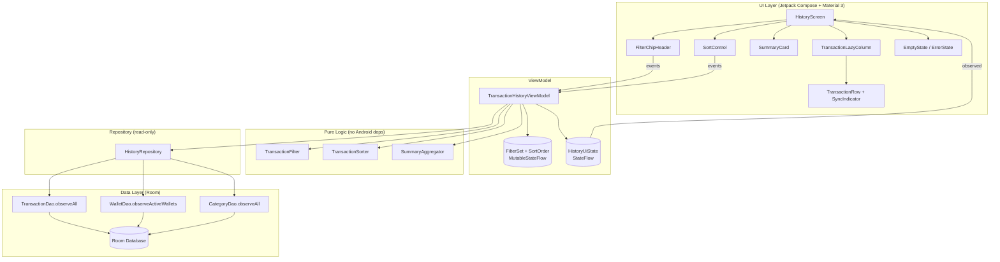
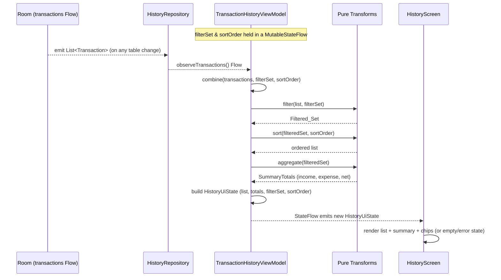

# Design Document: Transaction History & Audit

## Overview

The Transaction History & Audit feature implements **Scope 2** of the PRD: a read-only view over the transactions that the Transaction Input Engine (Scope 1) persists locally. It presents a scrollable `Transaction_List` with a horizontal header of filter chips, a single-select sort control, a dynamic `Summary_Card` that aggregates the currently filtered transactions, and a per-row `Sync_Indicator` derived from each transaction's `is_synced` value.

The feature is **strictly read-only** with respect to transactions. It observes the local Room store through reactive `Flow`s, applies filtering, sorting, and aggregation, and renders the result. It never inserts, updates, overrides, or deletes any `Transaction`, and it performs no network I/O — synchronization is a separate scope. Because observation is reactive, when Scope 1 writes a new transaction the list and the summary update automatically without a manual refresh (Requirement 2, AGENTS.md Data Rule 2).

This design **reuses Scope 1's domain model and data layer** rather than redefining them. It consumes the same `TransactionType` enum, the same `Transaction`/`Wallet`/`Category` domain models (amounts as non-negative `Long` values in the smallest currency unit), the same Room entities, and the existing DAO conventions. It adds only *read/query* capability: new observe methods on the data layer, a new read-only repository surface, a new ViewModel, and new Compose UI. The write path defined by Scope 1 is left untouched.

The design follows MVVM as mandated by `ARCHITECTURE.md`:

- **UI layer** — Jetpack Compose + Material 3. A `HistoryScreen` renders the filter chip header, sort control, `Summary_Card`, and a `LazyColumn` list. Pure rendering plus event dispatch; no business logic.
- **ViewModel** — `TransactionHistoryViewModel` owns and exposes a single immutable `HistoryUiState` via `StateFlow`. It holds the active `FilterSet` and `SortOrder`, combines the observed data streams, and applies pure filter/sort/aggregate transforms.
- **Repository** — a read-only surface exposing observable `Flow`s of transactions, wallets, and categories.
- **Data layer** — new read-only Room queries; no schema changes.

### Requirements Traceability Summary

| Area | Requirements |
| --- | --- |
| Display transaction list (rows, fields, integer amounts, empty/error state) | 1 |
| Real-time observation via reactive stream | 2 |
| Filter by transaction type | 3 |
| Filter by wallet (source OR destination) | 4 |
| Filter by category | 5 |
| Filter by synchronization status | 6 |
| Filter by time range | 7 |
| Combine active filters (OR within a dimension, AND across dimensions) | 8 |
| Sort (time / amount, with deterministic tie-breakers) | 9 |
| Dynamic summary card (income / expense / net, TRANSFER excluded) | 10 |
| Per-row synchronization indicator | 11 |
| Read-only boundary | 12 |

### Design Directives Honored (AGENTS.md)

- **Data Rule 2 (Flow/StateFlow real-time observation)** — the list and summary are driven by Room `Flow`s combined into a single `StateFlow<HistoryUiState>`, so any change Scope 1 makes to the `transactions` table propagates to the UI automatically (Requirements 2, 10.6, 11.3).
- **Data Rule 3 (override must not create a transaction entry)** — not applicable here; this feature never writes, so it cannot create entries.
- **UI Rule 1 (custom numpad, no OS keyboard for numbers)** — no numeric OS-keyboard input exists in this feature; the time-range filter uses a Material 3 date-range picker, not free numeric keyboard entry.
- **UI Rule 2 (one-handed ergonomics)** — the primary interaction cluster (filter chip header and sort control) is reachable and the list scrolls under it; interactive controls follow Material 3 touch-target sizing consistent with Scope 1's aesthetic.
- **Read-only boundary** — the repository exposes only `observe*` methods (no suspend write, no DAO mutation) so the read-only invariant (Requirement 12) holds by construction.

## Architecture

### Layered View



### Data Flow: Observation, Filter, Sort, Aggregate



When the user toggles a chip or changes the sort, the ViewModel updates its `filterSet`/`sortOrder` `MutableStateFlow`; `combine` re-runs the pure transforms against the latest observed transactions. When Scope 1 writes, the transactions `Flow` re-emits and `combine` re-runs against the unchanged `filterSet`/`sortOrder`. Both paths converge on the same recomputation, satisfying Requirements 2, 8, 9.7, and 10.5/10.6.

### Where filtering, sorting, and aggregation happen — and why

**Decision: observe the full transactions stream once and apply filtering, sorting, and aggregation as pure in-memory transforms in the ViewModel** — rather than pushing them into parameterized Room `@Query` statements.

Rationale:

- **Reactive correctness is simpler.** A single `observeTransactions()` `Flow` re-emits on any change to the `transactions` table. `combine`-ing it with the `filterSet`/`sortOrder` streams gives one recomputation path that handles both "data changed" and "filter changed" identically (Requirements 2.3, 2.4, 2.5, 8, 9.7). A SQL approach would require rebuilding the query — and re-subscribing the `Flow` — every time any chip toggles, which is more moving parts for the same result.
- **Dynamic multi-dimension combination is awkward in SQL.** The filter semantics are OR *within* each of five dimensions and AND *across* dimensions, with each dimension independently active/inactive (Requirement 8). Expressing that as dynamically assembled `WHERE` clauses with variadic `IN (...)` lists is error-prone; expressing it as a composable predicate over a decoded domain list is straightforward and directly testable.
- **The aggregation must match the filtered set exactly.** The `Summary_Card` aggregates precisely the `Filtered_Set` currently shown (Requirement 10.1, 10.5). Computing both the list and the totals from the *same* in-memory `Filtered_Set` guarantees they never diverge.
- **Testability.** Filtering, sorting, and aggregation become pure functions with no Android/Room dependency, so they are exhaustively property-testable (see Correctness Properties and Testing Strategy).

**Tradeoff (accepted):** in-memory filtering loads all transactions into memory and iterates them on each recomputation. For a personal finance tracker the row count is small (hundreds to low thousands), so the cost is negligible and dominated by UI recomposition. The read query is a plain `SELECT * FROM transactions` observed as a `Flow`; if the dataset ever grew large enough to matter, a coarse time-window `@Query` bound could be added upstream without changing the pure-transform design. This tradeoff is recorded so the choice is explicit.

### Threading

- Chip/sort events mutate only in-memory `StateFlow` values on the main thread (fast, synchronous).
- Room `Flow` collection and the `combine`/transform pipeline run in `viewModelScope`, flowing on `Dispatchers.IO` (via `flowOn`) so decoding and filtering/sorting/aggregation never block the main thread. The resulting `StateFlow` is observed by Compose on the main thread. This aligns with the Sync/Network directive of keeping the main thread free, applied here to read I/O and CPU-bound transforms.

## Components and Interfaces

### UI Layer (Jetpack Compose + Material 3)

`HistoryScreen(state: HistoryUiState, onEvent: (HistoryEvent) -> Unit)` — a stateless composable rendering the current `HistoryUiState` and forwarding user actions as events. Top region: the horizontal `FilterChipHeader` and the `SortControl`. Below: the `SummaryCard`. Below that: the `TransactionLazyColumn`, or an `EmptyState`/`ErrorState` when appropriate.

Child composables (all stateless, driven by state + lambdas):

- `FilterChipHeader(state, onEvent)` — a horizontally scrollable row of `FilterChip`s grouped by dimension: three type chips (EXPENSE/INCOME/TRANSFER, Requirement 3.1), one chip per available wallet (Requirement 4.1), one chip per available category (Requirement 5.1), a SYNCED and a PENDING chip (Requirement 6.1), and a single time-range chip that opens a date-range picker (Requirement 7.1). Each chip's selected state comes from the `FilterSet`; a tap emits a toggle event.
- `SortControl(selectedSort, onSortSelected)` — a single-choice control (segmented buttons or a dropdown menu) offering the four `SortOrder` values, exactly one selected (Requirement 9.1). Defaults to Time-Newest-First (Requirement 9.2).
- `SummaryCard(totals: SummaryTotals)` — displays the income total, the expense total, and the net total as separate values, each formatted as an integer in the smallest currency unit (Requirements 10.2, 10.3, 1.4). Shows zeros when the filtered set is empty (Requirement 10.7).
- `TransactionLazyColumn(rows, onEvent)` — a `LazyColumn` rendering one `TransactionRow` per item. Uses stable keys on `Transaction.id` so a single row's change re-renders only that row (Requirement 11.3).
- `TransactionRow(row: TransactionRowUi)` — renders the type, amount (integer smallest-unit), source wallet, category, and a human-readable date-time (Requirements 1.2, 1.4); for a TRANSFER it also renders the destination wallet (Requirement 1.3). Includes the `SyncIndicator`.
- `SyncIndicator(status: SyncStatus)` — a minimal icon (per Scope 1's aesthetic: a transparent check for SYNCED, a small hourglass/dot for PENDING), visually distinct between states (Requirements 11.1, 11.2). Any non-0/1 `is_synced` value is mapped to PENDING upstream (Requirement 11.4).
- `EmptyState(reason)` — shown when the `Filtered_Set` is empty, communicating that no transactions match the active filter (Requirements 1.6, 3.5, 4.6, 5.5, 6.7, 7.3, 7.5).
- `ErrorState()` — shown when a read fails, while the previously displayed list state is preserved in the UI (Requirement 1.7, 12.4).

The UI holds no logic beyond formatting and event dispatch. All filtering, sorting, and aggregation decisions arrive precomputed in `HistoryUiState`.

### Events

```kotlin
sealed interface HistoryEvent {
    data class TypeChipToggled(val type: TransactionType) : HistoryEvent
    data class WalletChipToggled(val walletId: Long) : HistoryEvent
    data class CategoryChipToggled(val categoryId: Long) : HistoryEvent
    data class SyncChipToggled(val status: SyncStatus) : HistoryEvent          // SYNCED | PENDING
    data class TimeRangeSelected(val startInclusive: Long, val endInclusive: Long) : HistoryEvent
    data object TimeFilterCleared : HistoryEvent
    data class SortSelected(val order: SortOrder) : HistoryEvent
}
```

Each toggle event flips membership of the corresponding selection inside the `FilterSet` (adding on activate, removing on deactivate — Requirements 3.4, 4.3, 5.4, 6.6). `TimeRangeSelected` sets the `TimeFilter`; `TimeFilterCleared` removes it (Requirement 7.4). `SortSelected` replaces the single active `SortOrder` while leaving the `FilterSet` untouched (Requirement 9.7).

### ViewModel

```kotlin
class TransactionHistoryViewModel(
    private val repository: HistoryRepository
) : ViewModel() {

    private val filterSet = MutableStateFlow(FilterSet())            // all dimensions inactive
    private val sortOrder = MutableStateFlow(SortOrder.TIME_NEWEST_FIRST) // default (Req 9.2)

    val uiState: StateFlow<HistoryUiState> = combine(
        repository.observeTransactions(),   // Flow<Result<List<Transaction>>>
        repository.observeWallets(),
        repository.observeCategories(),
        filterSet,
        sortOrder
    ) { txResult, wallets, categories, filters, sort ->
        buildState(txResult, wallets, categories, filters, sort)
    }
        .flowOn(Dispatchers.IO)
        .stateIn(viewModelScope, SharingStarted.WhileSubscribed(5_000), HistoryUiState.Initial)

    fun onEvent(event: HistoryEvent) { /* update filterSet / sortOrder */ }
}
```

`buildState` is a thin orchestration seam over the pure transforms:

```kotlin
private fun buildState(
    txResult: Result<List<Transaction>>,
    wallets: List<Wallet>,
    categories: List<Category>,
    filters: FilterSet,
    sort: SortOrder
): HistoryUiState {
    txResult.fold(
        onSuccess = { all ->
            val filtered = TransactionFilter.apply(all, filters)      // Filtered_Set
            val ordered  = TransactionSorter.sort(filtered, sort)
            val totals   = SummaryAggregator.aggregate(filtered)
            HistoryUiState(rows = ordered.toRows(wallets, categories), totals = totals,
                           filterSet = filters, sortOrder = sort, isError = false, chips = ...)
        },
        onFailure = { /* keep last good rows/totals, set isError = true (Req 1.7, 12.4) */ }
    )
}
```

The ViewModel performs no I/O beyond collecting the repository `Flow`s and never calls a write method — the read-only boundary holds structurally (Requirement 12).

### Pure Logic (extracted, no Android dependency)

These objects contain the input-varying logic and are the primary property-test targets:

```kotlin
object TransactionFilter {
    /** Returns the Filtered_Set: OR within each active dimension, AND across active dimensions
     *  (Requirement 8). An inactive dimension imposes no restriction. */
    fun apply(transactions: List<Transaction>, filters: FilterSet): List<Transaction>

    /** Predicate form used by apply(); exposed for direct testing. */
    fun matches(transaction: Transaction, filters: FilterSet): Boolean
}

object TransactionSorter {
    /** Total ordering per SortOrder, with deterministic tie-breakers (Requirement 9.5, 9.6). */
    fun sort(transactions: List<Transaction>, order: SortOrder): List<Transaction>
}

object SummaryAggregator {
    /** Sums INCOME and EXPENSE amounts separately, net = income - expense, TRANSFER excluded
     *  (Requirement 10.2, 10.3, 10.4, 10.7). */
    fun aggregate(transactions: List<Transaction>): SummaryTotals
}

object SyncStatusMapper {
    /** Maps is_synced to a status: 1 -> SYNCED, anything else (including non-0/1) -> PENDING
     *  (Requirements 11.1, 11.2, 11.4). */
    fun statusOf(isSyncedRaw: Int): SyncStatus
}
```

`TransactionFilter.matches` composes five per-dimension predicates:

- **Type:** inactive set → always true; otherwise `transaction.type ∈ selectedTypes` (Requirement 3).
- **Wallet:** inactive set → always true; otherwise `sourceWalletId ∈ selectedWallets OR destWalletId ∈ selectedWallets` (Requirement 4.2, 4.4).
- **Category:** inactive set → always true; otherwise `categoryId ∈ selectedCategories` (Requirement 5).
- **Sync:** inactive set → always true; otherwise `statusOf(isSynced) ∈ selectedSyncStatuses`; both selected admits values 0 or 1 (Requirement 6.3, 6.4, 6.5).
- **Time:** inactive → always true; a range with `start > end` matches nothing (Requirement 7.3); otherwise `start ≤ timestamp ≤ end` (Requirement 7.2).

### Repository (read-only)

```kotlin
interface HistoryRepository {
    /** Emits the full set of transactions on every change to the transactions table.
     *  Wrapped in Result so a read failure surfaces without crashing the stream (Req 1.7, 12.4). */
    fun observeTransactions(): Flow<Result<List<Transaction>>>

    /** Non-archived wallets available for the wallet filter chips (Requirement 4.1). */
    fun observeWallets(): Flow<List<Wallet>>

    /** Non-archived categories available for the category filter chips (Requirement 5.1). */
    fun observeCategories(): Flow<List<Category>>
}
```

There is deliberately **no** write method on this interface — the type itself enforces the read-only boundary (Requirement 12). The implementation maps Room entities to domain models using Scope 1's existing mappers and catches read errors into `Result.failure`.

### Data Layer (Room DAOs)

This feature adds read-only queries; it reuses Scope 1's entities and adds no schema changes.

```kotlin
// Added to the existing TransactionDao (read-only; alongside Scope 1's write methods)
@Query("SELECT * FROM transactions")
fun observeAll(): Flow<List<TransactionEntity>>

// Reused from Scope 1
@Dao interface WalletDao {
    @Query("SELECT * FROM wallets WHERE is_archived = 0")
    fun observeActiveWallets(): Flow<List<WalletEntity>>
}

// Added to CategoryDao (all non-archived categories, all types, for the category chips)
@Query("SELECT * FROM categories WHERE is_archived = 0")
fun observeAllActive(): Flow<List<CategoryEntity>>
```

`observeAll()` intentionally does not apply ordering or filtering in SQL — those are the ViewModel's pure transforms (see the "Where filtering, sorting, and aggregation happen" decision). Ordering in SQL would be redundant work because the sorter re-orders in memory anyway.

## Data Models

### Reused Domain Models (from Scope 1 — unchanged)

`TransactionType { EXPENSE, INCOME, TRANSFER }`, and the `Transaction`, `Wallet`, and `Category` domain models as defined by the Transaction Input Engine. Amounts remain non-negative `Long` values in the smallest currency unit. This feature adds no fields and changes no existing model.

### New Read-Side Models

```kotlin
enum class SyncStatus { SYNCED, PENDING }

enum class SortOrder {
    TIME_NEWEST_FIRST,   // default (Requirement 9.2)
    TIME_OLDEST_FIRST,
    AMOUNT_LARGEST_FIRST,
    AMOUNT_SMALLEST_FIRST
}

/** Inclusive time range for the Time_Filter (epoch millis). */
data class TimeFilter(val startInclusive: Long, val endInclusive: Long)

/**
 * The active Filter_Set across the five dimensions. An empty set in a dimension means that
 * dimension imposes no restriction (Requirements 3.2, 4.5, 5.2, 6.2, 8.4). A null timeFilter
 * means the Time dimension is inactive.
 */
data class FilterSet(
    val types: Set<TransactionType> = emptySet(),
    val walletIds: Set<Long> = emptySet(),
    val categoryIds: Set<Long> = emptySet(),
    val syncStatuses: Set<SyncStatus> = emptySet(),
    val timeFilter: TimeFilter? = null
) {
    val isEmpty: Boolean
        get() = types.isEmpty() && walletIds.isEmpty() && categoryIds.isEmpty() &&
                syncStatuses.isEmpty() && timeFilter == null
}

/** Aggregate totals over the Filtered_Set; TRANSFER excluded (Requirement 10). */
data class SummaryTotals(
    val incomeTotal: Long = 0L,
    val expenseTotal: Long = 0L
) {
    val netTotal: Long get() = incomeTotal - expenseTotal   // Requirement 10.3
}
```

### UI Models

```kotlin
/** One rendered row; TRANSFER carries a non-null destination wallet name (Requirement 1.3). */
data class TransactionRowUi(
    val id: String,
    val type: TransactionType,
    val amount: Long,
    val sourceWalletName: String,
    val destWalletName: String?,        // non-null only for TRANSFER
    val categoryName: String,
    val timestamp: Long,                // rendered as date-time (Requirement 1.2)
    val syncStatus: SyncStatus
)

data class HistoryUiState(
    val rows: List<TransactionRowUi> = emptyList(),
    val totals: SummaryTotals = SummaryTotals(),
    val filterSet: FilterSet = FilterSet(),
    val sortOrder: SortOrder = SortOrder.TIME_NEWEST_FIRST,
    val availableWallets: List<Wallet> = emptyList(),   // source of wallet chips
    val availableCategories: List<Category> = emptyList(), // source of category chips
    val isError: Boolean = false
) {
    val isEmpty: Boolean get() = rows.isEmpty()
    companion object { val Initial = HistoryUiState() }
}
```

Room entities are reused from Scope 1 (`TransactionEntity`, `WalletEntity`, `CategoryEntity`); no new entity or migration is introduced.

## Correctness Properties

*A property is a characteristic or behavior that should hold true across all valid executions of a system — essentially, a formal statement about what the system should do. Properties serve as the bridge between human-readable specifications and machine-verifiable correctness guarantees.*

The input-varying logic of this feature — filter combination, sorting, summary aggregation, sync-status mapping, and row mapping — is expressed as pure functions (`TransactionFilter`, `TransactionSorter`, `SummaryAggregator`, `SyncStatusMapper`, and the row mapper). Their behavior varies meaningfully across a large input space (arbitrary transaction lists, filter combinations, sort orders, timestamps, amounts, and raw sync values), which makes them ideal for property-based testing. UI composition (chip counts, empty/error rendering), OS-level date-picker behavior, `StateFlow` exposure, and Room reactive re-emission do not vary meaningfully with input and are covered by example, UI, and integration tests instead (see Testing Strategy).

The prework analysis reduced the many per-dimension acceptance criteria to a minimal, non-redundant set: the OR-within-dimension and AND-across-dimensions criteria (3.x, 4.x, 5.x, 6.x, 7.4, 8.x) collapse into one central combined-filter characterization plus two dimension-specific predicates that check something unique (wallet matching *two* fields, and the inclusive time range with its degenerate case); the four sort criteria collapse into one order-determinism property plus a permutation-invariance property; the summary criteria collapse into one aggregation property plus one metamorphic TRANSFER-exclusion property; and the read-only criteria collapse into one invariant.

### Property 1: Combined filter — OR within a dimension, AND across dimensions

*For any* list of `Transaction` records and *any* `FilterSet`, a `Transaction` appears in the `Filtered_Set` **if and only if**, for every *active* filter dimension, the `Transaction` matches at least one activated selection in that dimension: its `Transaction_Type` is in the selected types (when the type dimension is active), its source or destination `Wallet` is in the selected wallets (when active), its `Category` is in the selected categories (when active), its mapped `Sync_Status` is in the selected statuses (when active), and its timestamp is within the active `Time_Filter` range (when active). A dimension with no selection (empty set, or null `Time_Filter`) imposes no restriction; consequently, when the `FilterSet` is empty the `Filtered_Set` equals the input list.

**Validates: Requirements 3.2, 3.3, 3.4, 4.5, 5.2, 5.3, 5.4, 6.3, 6.4, 6.5, 6.6, 7.4, 8.1, 8.2, 8.3, 8.4**

### Property 2: Wallet filter matches source or destination

*For any* list of `Transaction` records and *any* non-empty set of selected wallet ids (with all other dimensions inactive), the `Filtered_Set` contains exactly those `Transaction` records whose source `Wallet` is in the selected set OR whose destination `Wallet` is in the selected set.

**Validates: Requirements 4.2, 4.4**

### Property 3: Time filter is an inclusive range and rejects inverted ranges

*For any* list of `Transaction` records and *any* `Time_Filter` with `start` and `end` (all other dimensions inactive): if `start ≤ end`, the `Filtered_Set` contains exactly those `Transaction` records whose timestamp `t` satisfies `start ≤ t ≤ end`; if `start > end`, the `Filtered_Set` is empty.

**Validates: Requirements 7.2, 7.3**

### Property 4: Sort order is deterministic with defined tie-breakers

*For any* list of `Transaction` records, sorting yields a total order determined by the selected `Sort_Order`: `TIME_NEWEST_FIRST` produces non-increasing timestamps; `TIME_OLDEST_FIRST` produces non-decreasing timestamps; `AMOUNT_LARGEST_FIRST` produces non-increasing amounts and, for equal amounts, non-increasing timestamps; `AMOUNT_SMALLEST_FIRST` produces non-decreasing amounts and, for equal amounts, non-increasing timestamps.

**Validates: Requirements 1.5, 9.3, 9.4, 9.5, 9.6**

### Property 5: Sorting is a permutation of its input

*For any* list of `Transaction` records and *any* `Sort_Order`, the sorted output is a permutation of the input — it contains exactly the same `Transaction` records with the same multiplicity and adds or removes none. In particular, sorting an empty list yields an empty list. (Combined with the filter/sort separation, changing the `Sort_Order` therefore never alters the `Filtered_Set`.)

**Validates: Requirements 9.7, 9.8**

### Property 6: Summary totals sum the filtered set by type

*For any* `Filtered_Set`, the `Summary_Card` income total equals the sum of the `Amount` of every `Transaction` whose `Transaction_Type` is INCOME, the expense total equals the sum of the `Amount` of every `Transaction` whose `Transaction_Type` is EXPENSE, and the net total equals the income total minus the expense total. For an empty `Filtered_Set` all three totals are zero.

**Validates: Requirements 10.2, 10.3, 10.7**

### Property 7: Transfers do not affect the summary totals

*For any* `Filtered_Set`, adding any number of `Transaction` records whose `Transaction_Type` is TRANSFER (with arbitrary amounts) leaves the income total, the expense total, and the net total unchanged.

**Validates: Requirements 10.4**

### Property 8: Sync-status mapping is total and defaults to pending

*For any* integer `is_synced` value, the derived `Sync_Status` is SYNCED when the value is exactly 1, and PENDING for every other value (including 0 and any value that is neither 0 nor 1).

**Validates: Requirements 11.1, 11.2, 11.4**

### Property 9: Reading, filtering, sorting, and aggregating never mutate the store

*For any* `Transactions_Store` contents and *any* sequence of read, filter, sort, and aggregation operations, the count of `Transaction` records and the field values of every `Transaction` record in the store after the sequence are identical to their values before the sequence.

**Validates: Requirements 12.1, 12.2, 12.3**

### Property 10: A rendered row faithfully reflects its transaction

*For any* `Transaction` and the corresponding wallet and category lookups, the produced row displays the `Transaction`'s type, its `Amount`, its source `Wallet`, its `Category`, and its timestamp; the destination `Wallet` is present exactly when the `Transaction_Type` is TRANSFER and absent otherwise.

**Validates: Requirements 1.2, 1.3**

## Error Handling

| Scenario | Handling | Requirement |
| --- | --- | --- |
| Read from the `Transactions_Store` fails | The repository maps the failure into `Result.failure` on the transactions `Flow`. The ViewModel keeps the last successfully rendered `rows`/`totals` in `HistoryUiState` and sets `isError = true`; the UI shows an `ErrorState` without discarding the prior list. No write occurs, so the store is untouched. | 1.7, 12.4 |
| `Filtered_Set` is empty (any dimension or combination yields no matches) | The ViewModel emits `HistoryUiState` with empty `rows`; the UI renders an `EmptyState` while retaining the active chip selections in `filterSet`. The summary shows zero income, zero expense, zero net (Property 6). | 1.6, 3.5, 4.6, 5.5, 6.7, 7.3, 7.5, 10.7 |
| Time-range filter with `start > end` | `TransactionFilter` treats the range as matching nothing (Property 3), producing an empty `Filtered_Set` and the `EmptyState`. | 7.3 |
| A displayed transaction has an `is_synced` value other than 0 or 1 | `SyncStatusMapper.statusOf` maps any non-1 value to PENDING (Property 8), so the row renders a well-defined pending indicator rather than crashing or showing an undefined state. | 11.4 |
| Wallet or category referenced by a transaction is missing from the lookup lists | The row mapper falls back to a placeholder label for the missing name rather than throwing, keeping the row renderable. | 1.2 |

No mutation path exists in this feature, so there is no failure mode that can alter a `Transaction`. The read-only boundary is enforced structurally by the repository interface exposing only `observe*` methods (Requirement 12).

## Testing Strategy

The feature is tested with a **dual approach**: property-based tests for the pure input-varying logic (filtering, sorting, aggregation, sync mapping, row mapping, read-only invariant) and example/UI/integration tests for UI composition, empty/error rendering, reactive `Flow` behavior, and read isolation against a real Room database.

### Property-Based Tests

- **Library:** [kotest-property](https://kotest.io/docs/proptest/property-based-testing.html) (Kotlin's established property-testing library), consistent with Scope 1. Property testing is **not** implemented from scratch.
- **Iterations:** each property test runs a minimum of **100 iterations** (`PropTestConfig(iterations = 100)` or higher).
- **Tagging:** each property test carries a comment in the format
  `// Feature: transaction-history-audit, Property {number}: {property_text}`.
- **Single test per property:** each of Properties 1–10 is implemented by exactly one property-based test.
- **Generators:**
  - A `Transaction` generator over arbitrary ids, timestamps (including duplicates to exercise tie-breakers), amounts in `0..MAX`, types, source/destination wallet ids, category ids, and `is_synced` values (including values outside {0,1} for Property 8).
  - A `FilterSet` generator that independently activates/deactivates each of the five dimensions and picks arbitrary selection subsets, including inverted time ranges (`start > end`).
  - Lists of `Transaction` of varying length, including the empty list.
- **Targets:**
  - Property 1 exercises `TransactionFilter.apply`/`matches` against generated lists and `FilterSet`s, asserting the iff characterization (cross-checked against an independent brute-force reference predicate — model-based testing).
  - Property 2 exercises the wallet dimension in isolation, asserting source-OR-destination membership.
  - Property 3 exercises the time dimension, including the `start > end` empty-result edge case.
  - Properties 4–5 exercise `TransactionSorter.sort` across all four `SortOrder` values, asserting adjacent-pair ordering with tie-breakers and multiset-permutation invariance.
  - Properties 6–7 exercise `SummaryAggregator.aggregate`, asserting per-type sums, the net relation, the empty-set zeros, and the metamorphic TRANSFER-exclusion invariant (adding TRANSFERs does not change totals).
  - Property 8 exercises `SyncStatusMapper.statusOf` over arbitrary integers.
  - Property 9 runs read/filter/sort/aggregate sequences against a **Room in-memory database** seeded with generated transactions, snapshotting the store before and after and asserting the count and every field value are unchanged.
  - Property 10 exercises the row mapper over generated transactions plus wallet/category lookups.

### Unit / Example Tests

- Initial state: default `Sort_Order` is `TIME_NEWEST_FIRST` (9.2); initial `FilterSet` has both sync statuses inactive and no time filter (6.2).
- Single-select sort: selecting a `Sort_Order` leaves exactly one active (9.1).
- Integer smallest-unit amount formatting on the row and summary (1.4).
- ViewModel read-failure handling: repository emits `Result.failure` → `isError = true`, previous rows retained (1.7, 12.4).

### Compose UI Tests

- Chip composition counts: exactly three type chips (3.1), one chip per available wallet (4.1), one chip per available category (5.1), a SYNCED and a PENDING chip (6.1), and a time-filter chip (7.1).
- Empty-state rendering when the `Filtered_Set` is empty, with chip selections retained (1.6, 3.5, 4.6, 5.5, 6.7, 7.5).
- Error-state rendering on read failure without clearing the prior list (1.7).
- Per-row sync indicator: the SYNCED and PENDING states render visually distinct icons (11.1, 11.2); with stable `LazyColumn` keys, changing one transaction's `is_synced` updates only that row (11.3).
- Summary card renders income, expense, and net as separate values (10.2, 10.3).

### Room Integration Tests (in-memory database)

- Reactive observation: after Scope 1 inserts a transaction, the observed `Flow` re-emits an updated `Transaction_List` and the summary recomputes over the resulting `Filtered_Set` (2.1, 2.2, 2.3, 10.5, 10.6).
- A change to an existing transaction re-emits an updated list (2.4); a removal re-emits a list excluding it (2.5).
- Read isolation: observing/filtering/sorting/aggregating leaves the `transactions` table row count and field values unchanged (complements Property 9 at the real-DB boundary — 12.1, 12.2, 12.3).

### Why parts of the feature are not property-tested

UI composition, empty/error rendering, OS date-picker behavior, `StateFlow` exposure, and Room reactive re-emission do not vary meaningfully with input — running them 100 times finds nothing a single well-chosen example does not. They are covered by Compose UI tests and Room integration tests, per the guidance that PBT targets input-varying pure logic rather than framework/IO behavior.
