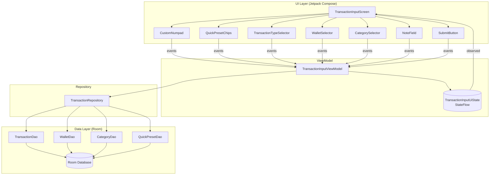

# Design Document: Transaction Input Engine

## Overview

The Transaction Input Engine implements Scope 1 of the PRD: frictionless manual entry of financial transactions on Android. It captures an amount via a custom in-app numpad (no OS keyboard for numbers), supports accumulative quick-preset chips, lets the user pick a transaction type, source/destination wallet, and category, and optionally a note. On submit it persists the transaction and applies the corresponding wallet balance changes **atomically** to the local Room database, marking the record as unsynced (`is_synced = 0`) for a separate synchronization scope to transmit later.

The design follows MVVM as mandated by `ARCHITECTURE.md`:

- **UI layer** — Jetpack Compose + Material 3 composables. Pure rendering + event dispatch; holds no business logic.
- **ViewModel** — Owns and exposes a single immutable UI state via `StateFlow`. Handles numpad accumulation, preset accumulation, validation gating, and orchestrates persistence.
- **Repository** — Exposes suspend operations and observable `Flow`s. Performs the atomic insert-log + update-balance operation.
- **Data layer** — Room entities and DAOs; the `@Transaction`-annotated DAO method is the atomic boundary.

Amounts are represented throughout as **non-negative integers in the smallest currency unit** (e.g. rupiah), never floating point. This avoids rounding drift and matches the `amount: integer` shape in `API_SPEC.json`.

### Requirements Traceability Summary

| Area | Requirements |
| --- | --- |
| Custom numpad amount entry | 1, 2 |
| Type / wallet / category selection | 3, 4, 5 |
| Optional note (no OS keyboard until tapped) | 6 |
| Submit validation gating | 7 |
| One-handed ergonomic layout | 8 |
| Atomic persistence with balance update | 9 |
| Identity + metadata | 10 |
| Unsynced flag | 11 |
| Real-time observation + reset | 12 |

### Design Directives Honored (AGENTS.md)

- **UI Rule 1** — Amount entry uses `CustomNumpad`; the amount field is non-focusable, so the OS keyboard never appears for numeric input.
- **UI Rule 2** — Numpad, preset chips, and `Submit_Control` are placed in the lower region of the screen for thumb reach.
- **Data Rule 1** — All persistence flows through a single `@Transaction` DAO method that inserts the log and updates the wallet balance together.
- **Data Rule 2** — Wallet balances and category/wallet lists are observed via Room `Flow` and surfaced to the UI as `StateFlow`.
- **Data Rule 3** — This feature never performs a direct balance override, and its atomic write always pairs a balance change with a transaction insert, so the "override must not create a transaction entry" rule is not violated (override remains out of scope).

## Architecture

### Layered View



### Atomic Save Flow (Offline-First)

```mermaid
sequenceDiagram
    participant U as User
    participant S as TransactionInputScreen
    participant VM as TransactionInputViewModel
    participant R as TransactionRepository
    participant D as Room (@Transaction DAO)

    U->>S: Tap Submit (enabled)
    S->>VM: onSubmit()
    VM->>VM: build Transaction (uuid, now, type, amount, wallets, category, note, is_synced=0)
    VM->>R: saveTransaction(transaction)
    R->>D: @Transaction { insert(tx); updateBalance(...) }
    alt commit succeeds
        D-->>R: Unit
        R-->>VM: Result.Success
        VM->>VM: reset amount=0, category=none
        Note over D: wallets Flow emits new balance
    else commit fails
        D-->>R: throws
        R-->>VM: Result.Failure(error)
        VM->>VM: keep state, set error message
    end
```

Key point: the balance update and the log insert live in the **same** `@Transaction` DAO method. Room rolls back both if either fails (Requirement 9.5). Because the wallet row is updated inside Room, the `wallets` `Flow` emits the new balance automatically, satisfying real-time observation (Requirement 12) without any manual UI refresh.

### Threading

- UI events are handled on the main thread in the ViewModel, which only mutates in-memory state (fast, synchronous).
- Persistence runs inside `viewModelScope` on `Dispatchers.IO` via suspend functions; the `@Transaction` DAO method executes off the main thread. This keeps the main thread free (aligns with the Sync/Network directive of not blocking the UI thread, applied here to DB I/O).

## Components and Interfaces

### UI Layer (Jetpack Compose)

`TransactionInputScreen(state, onEvent)` — stateless composable that renders the current `TransactionInputUiState` and forwards user actions as events. Layout places the read-only amount display near the top/middle and the interaction cluster (type selector, chips, numpad, submit) in the lower region (Requirement 8). The numpad is sized compactly (flatter keys, tightened spacing) so that on typical phone screens the upper metadata region — including the optional `NoteField` — fits without needing to scroll to reach the note; the upper region remains scrollable as a fallback for very short screens.

Child composables (all stateless, driven by state + lambdas):

- `AmountDisplay(runningAmount)` — renders `Running_Amount` formatted as integer smallest-unit currency; **not focusable**, so no OS keyboard (Requirements 1, 5-of-R1).
- `CustomNumpad(onDigit, onDelete)` — digit keys 0-9 and a delete key (Requirements 1.2, 1.3, 1.4). Keys use a flatter aspect ratio and tightened row/padding spacing to keep the keypad short, so the note field stays reachable without scrolling while touch targets remain comfortably tappable.
- `QuickPresetChips(presets, onPresetTap)` — renders configured `Preset_Chip` set; each tap emits its value (Requirement 2).
- `TransactionTypeSelector(selectedType, onTypeSelected)` — single-choice among EXPENSE/INCOME/TRANSFER (Requirement 3).
- `WalletSelector(wallets, sourceWalletId, destWalletId, type, onSourceSelected, onDestSelected)` — source always shown; destination shown only for TRANSFER (Requirement 4).
- `CategorySelector(categories, selectedCategoryId, onCategorySelected)` — shows categories filtered to the current type (Requirement 5).
- `NoteField(note, onNoteChanged)` — a text field that shows the OS keyboard only when tapped/focused (Requirement 6).
- `SubmitButton(enabled, onSubmit)` — enabled purely from `state.isSubmitEnabled` (Requirement 7); positioned in the lower region (Requirement 8).

The UI holds no logic beyond formatting and event dispatch. All decisions (accumulation, filtering, validation) come from the ViewModel state.

### ViewModel

```kotlin
class TransactionInputViewModel(
    private val repository: TransactionRepository,
    private val clock: Clock = Clock.systemUTC(),
    private val idGenerator: () -> String = { UUID.randomUUID().toString() }
) : ViewModel() {

    val uiState: StateFlow<TransactionInputUiState>

    fun onEvent(event: TransactionInputEvent)
}
```

`clock` and `idGenerator` are injected so identity/timestamp assignment (Requirement 10) is deterministic under test.

Events:

```kotlin
sealed interface TransactionInputEvent {
    data class DigitPressed(val digit: Int) : TransactionInputEvent      // 0..9
    data object DeletePressed : TransactionInputEvent
    data class PresetTapped(val value: Long) : TransactionInputEvent
    data class TypeSelected(val type: TransactionType) : TransactionInputEvent
    data class SourceWalletSelected(val walletId: Long) : TransactionInputEvent
    data class DestWalletSelected(val walletId: Long) : TransactionInputEvent
    data class CategorySelected(val categoryId: Long) : TransactionInputEvent
    data class NoteChanged(val text: String) : TransactionInputEvent
    data object Submit : TransactionInputEvent
    data object ErrorConsumed : TransactionInputEvent
}
```

Core pure logic (unit/property-testable, extracted into a helper object so it can be exercised without Android):

```kotlin
object AmountReducer {
    const val MAX_AMOUNT: Long = 999_999_999_999L  // guard against overflow

    fun appendDigit(current: Long, digit: Int): Long   // clamps at MAX_AMOUNT
    fun deleteDigit(current: Long): Long               // integer div by 10, floors at 0
    fun addPreset(current: Long, presetValue: Long): Long // clamps at MAX_AMOUNT
}

object SubmitValidator {
    fun isSubmitEnabled(state: TransactionInputUiState): Boolean
}
```

Validation rule (Requirement 7 + 4.4):
`amount > 0` AND a category is selected AND, when type is TRANSFER, a destination wallet is selected and differs from the source wallet.

On `Submit` (when enabled), the ViewModel builds a `Transaction`, calls `repository.saveTransaction(...)`, and on success resets `runningAmount = 0` and `selectedCategoryId = null` (Requirement 12.3) while preserving type and wallet selections for fast repeat entry. On failure it keeps the state and exposes an `errorMessage` (Requirement 9.5).

### Repository

```kotlin
interface TransactionRepository {
    fun observeWallets(): Flow<List<Wallet>>
    fun observeCategories(type: TransactionType): Flow<List<Category>>
    fun observeQuickPresets(): Flow<List<QuickPreset>>
    fun observeDefaultWallet(): Flow<Wallet?>
    suspend fun saveTransaction(transaction: Transaction): Result<Unit>
}
```

`saveTransaction` computes the balance delta from the transaction type and delegates to a single `@Transaction` DAO method. It maps thrown exceptions to `Result.failure` so the ViewModel never sees raw exceptions (Requirement 9.5). All observe* methods return Room `Flow`s (Requirement 12.1, Data Rule 2).

### Data Layer (Room DAOs)

```kotlin
@Dao
interface TransactionDao {
    @Insert
    suspend fun insert(tx: TransactionEntity)

    @Query("UPDATE wallets SET balance = balance + :delta WHERE id = :walletId")
    suspend fun applyBalanceDelta(walletId: Long, delta: Long)

    // The atomic boundary (Data Rule 1, Requirement 9).
    @Transaction
    suspend fun insertAndApplyBalances(
        tx: TransactionEntity,
        sourceWalletId: Long,
        sourceDelta: Long,
        destWalletId: Long?,
        destDelta: Long
    ) {
        insert(tx)
        applyBalanceDelta(sourceWalletId, sourceDelta)
        if (destWalletId != null) applyBalanceDelta(destWalletId, destDelta)
    }
}

@Dao
interface WalletDao {
    @Query("SELECT * FROM wallets WHERE is_archived = 0")
    fun observeActiveWallets(): Flow<List<WalletEntity>>

    @Query("SELECT * FROM wallets WHERE is_default = 1 LIMIT 1")
    fun observeDefaultWallet(): Flow<WalletEntity?>
}

@Dao
interface CategoryDao {
    @Query("SELECT * FROM categories WHERE type = :type AND is_archived = 0")
    fun observeByType(type: String): Flow<List<CategoryEntity>>
}

@Dao
interface QuickPresetDao {
    @Query("SELECT * FROM quick_presets ORDER BY amount ASC")
    fun observeAll(): Flow<List<QuickPresetEntity>>
}
```

The balance deltas are derived by the repository before calling the DAO so the DAO stays a mechanical, testable unit:

- EXPENSE: `sourceDelta = -amount`, no dest (Requirement 9.2)
- INCOME: `sourceDelta = +amount`, no dest (Requirement 9.3)
- TRANSFER: `sourceDelta = -amount`, `destDelta = +amount` (Requirement 9.4)

## Data Models

### Domain Models

```kotlin
enum class TransactionType { EXPENSE, INCOME, TRANSFER }

data class Transaction(
    val id: String,              // UUID (Requirement 10.1)
    val timestamp: Long,         // epoch millis (Requirement 10.2)
    val type: TransactionType,
    val amount: Long,            // smallest currency unit, > 0 when persisted
    val sourceWalletId: Long,
    val destWalletId: Long?,     // non-null only for TRANSFER (Requirement 10.4/10.5)
    val categoryId: Long,
    val note: String,            // "" when omitted (Requirement 6.4)
    val isSynced: Boolean        // false (=0) on creation (Requirement 11)
)

data class Wallet(val id: Long, val name: String, val balance: Long, val isDefault: Boolean, val isArchived: Boolean)
data class Category(val id: Long, val name: String, val type: TransactionType, val icon: String, val isArchived: Boolean)
data class QuickPreset(val id: Long, val amount: Long, val label: String)
```

### UI State

```kotlin
data class TransactionInputUiState(
    val runningAmount: Long = 0L,
    val selectedType: TransactionType = TransactionType.EXPENSE, // default (Requirement 3.2)
    val sourceWalletId: Long? = null,   // set to default wallet id when loaded (Requirement 4.1)
    val destWalletId: Long? = null,
    val selectedCategoryId: Long? = null,
    val note: String = "",
    val wallets: List<Wallet> = emptyList(),
    val categories: List<Category> = emptyList(), // already filtered to selectedType
    val presets: List<QuickPreset> = emptyList(),
    val isSaving: Boolean = false,
    val errorMessage: String? = null
) {
    val isSubmitEnabled: Boolean get() = SubmitValidator.isSubmitEnabled(this)
}
```

### Room Entities

Entities map 1:1 to the `ARCHITECTURE.md` schema (an `is_archived` flag is added to `wallets` and `categories` to support the "non-archived" selection wording in Requirements 4.2/5.x and the PRD's Archive capability; it does not affect other scopes).

```kotlin
@Entity(tableName = "transactions")
data class TransactionEntity(
    @PrimaryKey val id: String,
    val timestamp: Long,
    val type: String,               // TransactionType.name
    val amount: Long,
    @ColumnInfo(name = "source_wallet") val sourceWalletId: Long,
    @ColumnInfo(name = "dest_wallet") val destWalletId: Long?,
    @ColumnInfo(name = "category_id") val categoryId: Long,
    val note: String,
    @ColumnInfo(name = "is_synced") val isSynced: Int   // 0 = unsynced
)

@Entity(tableName = "wallets")
data class WalletEntity(
    @PrimaryKey(autoGenerate = true) val id: Long,
    val name: String,
    val balance: Long,
    @ColumnInfo(name = "is_default") val isDefault: Boolean,
    @ColumnInfo(name = "is_archived") val isArchived: Boolean = false
)

@Entity(tableName = "categories")
data class CategoryEntity(
    @PrimaryKey(autoGenerate = true) val id: Long,
    val name: String,
    val type: String,
    val icon: String,
    @ColumnInfo(name = "is_archived") val isArchived: Boolean = false
)

@Entity(tableName = "quick_presets")
data class QuickPresetEntity(
    @PrimaryKey(autoGenerate = true) val id: Long,
    val amount: Long,
    val label: String
)
```

The `TransactionEntity` field set is a superset of the `API_SPEC.json` payload, so a later sync scope can map it directly (category resolves to its name at sync time). This feature only guarantees `is_synced = 0` on write; transmission is out of scope.

## Correctness Properties

*A property is a characteristic or behavior that should hold true across all valid executions of a system — essentially, a formal statement about what the system should do. Properties serve as the bridge between human-readable specifications and machine-verifiable correctness guarantees.*

The pure logic of this feature — amount accumulation, validation gating, category filtering, and balance-delta computation — is expressed as pure functions (`AmountReducer`, `SubmitValidator`, category/wallet filters, and the repository's delta logic). These are ideal for property-based testing because their behavior varies meaningfully across a large input space (arbitrary amounts, digit sequences, preset sequences, wallet lists, and state combinations). UI positioning, OS-keyboard behavior, and database transactionality are validated by Compose UI tests and Room integration tests instead (see Testing Strategy).

### Property 1: Digit append multiplies and adds

*For any* current `Running_Amount` and *any* digit `d` in 0..9, appending the digit yields `current * 10 + d`, unless that would exceed `MAX_AMOUNT`, in which case the amount is left clamped at `MAX_AMOUNT`.

**Validates: Requirements 1.2**

### Property 2: Digit delete drops the least significant digit

*For any* current `Running_Amount`, deleting a digit yields `current / 10` using integer division; in particular, deleting when the amount is 0 leaves it at 0.

**Validates: Requirements 1.3, 1.4**

### Property 3: Preset taps accumulate additively

*For any* starting `Running_Amount` and *any* sequence of `Preset_Chip` values, applying the taps in order yields `start + sum(values)`, clamped at `MAX_AMOUNT`. (A single tap is the one-element case, so single-tap addition is subsumed.)

**Validates: Requirements 2.2, 2.3**

### Property 4: Submit control is enabled exactly when the entry is valid

*For any* input state, the `Submit_Control` is enabled if and only if `Running_Amount > 0` AND a `Category` is selected AND (the `Transaction_Type` is not TRANSFER, OR a destination wallet is selected that differs from the source wallet).

**Validates: Requirements 7.1, 7.2, 7.3, 4.4**

### Property 5: Presented categories match the selected type

*For any* set of `Category` records and *any* selected `Transaction_Type`, the categories presented for selection are exactly the non-archived categories whose type equals the selected type.

**Validates: Requirements 5.2, 5.3**

### Property 6: Type and category selection are single-valued

*For any* selection action, after selecting a `Transaction_Type` exactly that type is active (no other), and after selecting a `Category` exactly that category is active (no other).

**Validates: Requirements 3.1, 5.1**

### Property 7: Selectable wallet sets exclude archived and self

*For any* set of `Wallet` records, the selectable source wallets are exactly the non-archived wallets; and for a TRANSFER with a chosen source, the selectable destination wallets are exactly the non-archived wallets excluding the source wallet.

**Validates: Requirements 4.2, 4.3**

### Property 8: Balance deltas are correct for each transaction type

*For any* wallet balances and *any* positive `amount`, after persisting a transaction the source wallet balance changes by `-amount` for EXPENSE, by `+amount` for INCOME, and by `-amount` for TRANSFER, while for TRANSFER the destination wallet balance changes by `+amount`. All other wallets are unchanged.

**Validates: Requirements 9.2, 9.3, 9.4**

### Property 9: Transfers conserve combined balance

*For any* source and destination wallet balances and *any* positive `amount`, persisting a TRANSFER leaves the combined balance of the source and destination wallets unchanged.

**Validates: Requirements 9.4**

### Property 10: Persisted transaction faithfully records the input state

*For any* valid input state, the constructed `Transaction` records the selected type, the `Running_Amount` as amount, the source wallet, the category, and the note equal to the state; the destination wallet is the selected destination when the type is TRANSFER and is null when the type is EXPENSE or INCOME.

**Validates: Requirements 10.3, 10.4, 10.5**

### Property 11: Every persisted transaction has a unique, non-empty id

*For any* sequence of persisted transactions, each is assigned a non-empty id and no two transactions share the same id.

**Validates: Requirements 10.1**

### Property 12: Every persisted transaction is marked unsynced

*For any* valid input state, the constructed `Transaction` has its `Sync_Flag` set to 0 (unsynced).

**Validates: Requirements 11.1**

### Property 13: A successful save resets amount and category

*For any* input state, after a successful persistence the resulting state has `Running_Amount` equal to 0 and no `Category` selected, while the selected type and wallet selections are preserved.

**Validates: Requirements 12.3**

## Error Handling

| Scenario | Handling | Requirement |
| --- | --- | --- |
| Atomic write fails mid-commit (insert or balance update throws) | Room rolls back the entire `@Transaction`, leaving `transactions` and `wallets` unchanged. The repository catches the exception and returns `Result.failure`. The ViewModel keeps the current UI state (no reset) and sets `errorMessage`. | 9.5 |
| Submit invoked while invalid | Guarded twice: the `SubmitButton` is disabled via `isSubmitEnabled`, and the ViewModel re-checks `SubmitValidator` before building the transaction, ignoring the event if invalid. | 7.1-7.3, 4.4 |
| Digit append would overflow | `AmountReducer.appendDigit` clamps at `MAX_AMOUNT` instead of overflowing to a negative/wrapped value. | 1.2 |
| Preset add would overflow | `AmountReducer.addPreset` clamps at `MAX_AMOUNT`. | 2.2, 2.3 |
| Delete at zero amount | `AmountReducer.deleteDigit` floors at 0 (integer division of 0). | 1.4 |
| No default wallet configured | `observeDefaultWallet()` emits null; the ViewModel leaves `sourceWalletId` null and keeps Submit disabled (no valid source), surfacing no crash. | 4.1, 7 |
| Note left empty | Persisted as an empty string, not null. | 6.4 |

Errors are surfaced to the UI as a transient `errorMessage` in state; the UI shows it (e.g. a snackbar) and dispatches `ErrorConsumed` to clear it. No raw exceptions cross the ViewModel boundary.

## Testing Strategy

The feature is tested with a **dual approach**: property-based tests for the pure input-varying logic, and example/integration tests for UI behavior and database transactionality.

### Property-Based Tests

- **Library:** [kotest-property](https://kotest.io/docs/proptest/property-based-testing.html) (Kotlin's established property-testing library). Property testing is **not** implemented from scratch.
- **Iterations:** each property test runs a minimum of **100 iterations** (`PropTestConfig(iterations = 100)` or higher).
- **Tagging:** each property test carries a comment in the format
  `// Feature: transaction-input-engine, Property {number}: {property_text}`.
- **Single test per property:** each of Properties 1-13 is implemented by exactly one property-based test.
- **Targets and generators:**
  - Properties 1-3 exercise `AmountReducer` with generators over amounts (`0..MAX_AMOUNT`), digits (`0..9`), and lists of preset values.
  - Property 4 generates full `TransactionInputUiState` values (varying amount, category presence, type, source/dest).
  - Properties 5-7 generate lists of `Category`/`Wallet` with random archived flags and types.
  - Properties 8-9 run the repository delta logic against a **Room in-memory database** (or a fake DAO) with generated balances and amounts, asserting post-balances and the transfer conservation invariant.
  - Properties 10-13 generate valid input states, invoke the transaction-build + save path (with injected `clock` and `idGenerator`), and assert field mapping, id uniqueness across sequences, the unsynced flag, and post-save reset.

### Unit Tests (example / edge case)

- Initial-state defaults: default type is EXPENSE (3.2), source wallet set to default on load (4.1), empty note persists as "" (6.4).
- Integer-unit formatting of the amount display (1.5).
- `deleteDigit(0) == 0` explicit example (1.4).
- Repository maps a thrown DAO exception to `Result.failure` (9.5).

### Compose UI Tests

- Numpad is displayed and the amount field is non-focusable, so the OS keyboard is not requested for numbers (1.1, UI Rule 1).
- Preset chip set renders (2.1); selected type/category render as active (3.3, 5.4); updated amount is displayed after preset/digit input (2.4).
- Note field keeps the keyboard hidden until focused and shows it on tap (6.2, 6.3); accepts free text (6.1).
- Layout: numpad and submit control bounds fall in the lower region of the screen (8.1, 8.2, UI Rule 2).

### Room Integration Tests (in-memory database)

- Atomic write commits both the transaction insert and the balance update together (9.1).
- Induced-failure test: a failing balance update rolls back the insert, leaving both stores unchanged, and the repository returns failure (9.5).
- `observeWallets()` emits an updated balance after a wallet update, confirming real-time `Flow` observation (12.1, 12.2, Data Rule 2).

### Why parts of the feature are not property-tested

UI positioning, OS-keyboard suppression, and Room transactionality/rollback do not vary meaningfully with input — running them 100 times finds nothing a single well-chosen example does not. They are covered by Compose UI tests and Room integration tests, per the guidance that PBT targets input-varying pure logic rather than framework/IO behavior.
